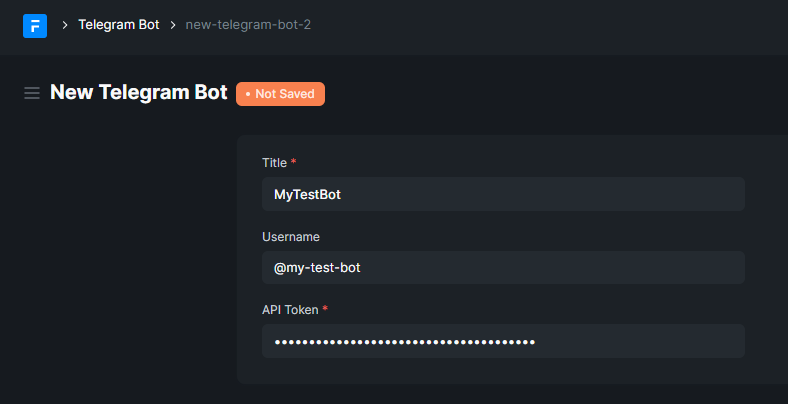

# Basic Setup

- Let's start by installing the app in your site

  ```bash
  # Get the app
  $ bench get-app https://github.com/leam-tech/frappe_telegram

  # Install the app on your site
  $ bench --site <your-site> install-app frappe_telegram
  ```

- Get your telegram-bot's `api-token` from [@BotFather](https://t.me/botfather)
- Go into your frappe site and create a new `Telegram Bot` and provide API Token and username

  

- We're done! Start your bot by executing the following:

  ```bash
  # bot-name is the name of the TelegramBot document that we just made
  $ bench telegram start-bot '<your-bot-name>'
  ```